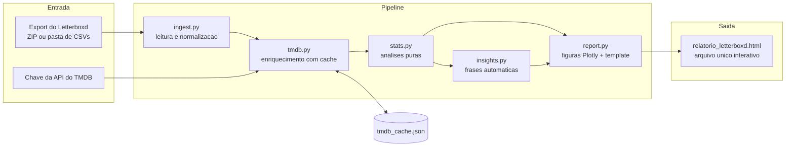

# letterboxd-explorer

Análise exploratória completa do seu histórico do Letterboxd: você entrega o export oficial da sua conta e recebe um **relatório HTML interativo em arquivo único**, pronto para abrir em qualquer navegador e enviar por e-mail ou WhatsApp.

Construído em Python com pandas e Plotly, enriquecido com metadados da [API do TMDB](https://developer.themoviedb.org/) (gêneros, diretores, elenco, países, duração, keywords), com cache local, testes automatizados e CI.

---

## 1. O problema

O Letterboxd permite exportar todos os seus dados (Settings, Data, Export your data), mas o export traz apenas título, ano, nota e data de cada filme. Nada de gênero, diretor ou país. Este projeto resolve isso em duas etapas: primeiro cruza cada filme do seu export com o banco de dados aberto do TMDB, depois gera um relatório visual que responde perguntas como:

* Quais gêneros, diretores e países dominam o que você assiste?
* Você é mais generoso ou mais exigente que a média das pessoas?
* Quais são suas maiores "heresias" (filmes que você ama e o mundo odeia, e vice-versa)?
* Como seu gosto mudou ano a ano?
* Qual foi sua maior maratona de dias seguidos com filme?

## 2. O que o relatório mostra

| Seção | O que revela |
|---|---|
| Cards de destaque | Total de filmes, horas de tela, nota média, rewatches, recorde anual |
| Insights automáticos | Frases estilo "Wrapped": seu dia de cinema, maior maratona, filme-conforto, sua generosidade vs. a média |
| Ritmo | Filmes por mês e heatmap de dia da semana por mês |
| Notas | Distribuição das suas notas e evolução da nota média ano a ano |
| Você vs. crítica | Sua nota contra a do TMDB, com as maiores divergências destacadas |
| Décadas e arqueologia | Quando os filmes foram lançados e quantos anos você demora para vê-los |
| Gêneros | Mais vistos, mais bem avaliados e "suas fases" (evolução ano a ano) |
| Microgêneros | Keywords do TMDB: slow burn, coming of age, neo-noir, found footage... |
| Pessoas | Diretores mais vistos e favoritos por nota; atores mais frequentes |
| Mapa-múndi | Choropleth dos países de produção do seu cinema |
| Extras | Idiomas, duração, filmes-conforto (rewatches), obscurômetro |

## 3. Arquitetura



```
src/letterboxd_explorer/
├── cli.py        # interface de linha de comando
├── ingest.py     # leitura do export (ZIP ou pasta) e normalização
├── tmdb.py       # cliente TMDB: cache em disco, retry, rate limit, chave v3 ou token v4
├── stats.py      # análises puras sobre DataFrames (testáveis, sem I/O)
├── insights.py   # geração das frases-insight
└── report.py     # figuras Plotly e template HTML de arquivo único
```

As análises em `stats.py` são funções puras: fáceis de testar com pytest e de reaproveitar em outro front-end no futuro.

## 4. Como usar (passo a passo completo)

O guia abaixo assume que você nunca programou. Se você já usa Python, pule para a seção 5.

### 4.1. Instale o Python

1. Acesse [python.org/downloads](https://www.python.org/downloads/) e baixe a versão mais recente (3.10 ou superior).
2. No Windows, durante a instalação, **marque a caixa "Add Python to PATH"** antes de clicar em Install. Esse é o passo que mais causa problema depois quando esquecido.
3. No macOS e Linux o Python geralmente já vem instalado. Para conferir, abra o Terminal e digite `python3 --version`.

### 4.2. Baixe este projeto

Você não precisa saber usar git:

1. Nesta página do GitHub, clique no botão verde **Code** e depois em **Download ZIP**.
2. Extraia o ZIP em uma pasta fácil de achar, por exemplo `Documentos/letterboxd-explorer`.

### 4.3. Exporte seus dados do Letterboxd

1. Entre no [letterboxd.com](https://letterboxd.com) pelo navegador (no app não tem essa opção).
2. Vá em **Settings**, aba **Data**, e clique em **Export your data**.
3. Um arquivo tipo `letterboxd-seuusuario-2026-07-10.zip` será baixado. Mova esse ZIP para a pasta do projeto. Não precisa extrair.

### 4.4. Crie sua chave gratuita do TMDB

1. Crie uma conta em [themoviedb.org/signup](https://www.themoviedb.org/signup