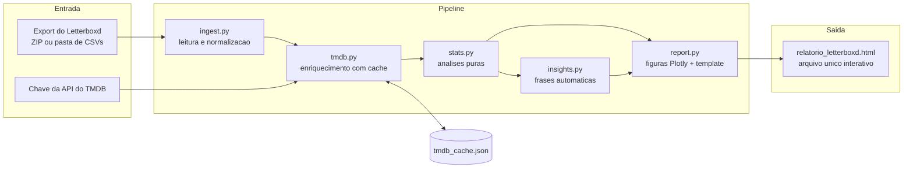

# letterboxd-explorer

Análise exploratória completa do seu histórico do Letterboxd: você entrega o export oficial da sua conta e recebe um **relatório HTML interativo em arquivo único**, pronto para abrir em qualquer navegador e enviar por e-mail ou WhatsApp.

Construído em Python com pandas e Plotly, enriquecido com metadados da [API do TMDB](https://developer.themoviedb.org/) (gêneros, diretores, elenco, países, duração, keywords), com cache local, testes automatizados e CI.

---

## 1. O problema

O Letterboxd permite exportar todos os seus dados (Settings, Data, Export your data), mas o export traz apenas título, ano, nota e data de cada filme. Nada de gênero, diretor ou país. Este projeto resolve isso em duas etapas: primeiro cruza cada filme do seu export com o banco de dados aberto do TMDB, depois gera um relatório visual que responde perguntas como:

* Quais gêneros, diretores e países dominam o que você assiste?
* Você é mais generoso ou mais exigente que a média das pessoas?
* Quais são suas maiores "heresias" (filmes que você ama e o mundo odeia, e vice-versa)?
* Como seu gosto mudou ano a ano?
* Qual foi sua maior maratona de dias seguidos com filme?

## 2. O que o relatório mostra

| Seção | O que revela |
|---|---|
| Cards de destaque | Total de filmes, horas de tela, nota média, rewatches, recorde anual |
| Insights automáticos | Frases estilo "Wrapped": seu dia de cinema, maior maratona, filme-conforto, sua generosidade vs. a média |
| Ritmo | Filmes por mês e heatmap de dia da semana por mês |
| Notas | Distribuição das suas notas e evolução da nota média ano a ano |
| Você vs. crítica | Sua nota contra a do TMDB, com as maiores divergências destacadas |
| Décadas e arqueologia | Quando os filmes foram lançados e quantos anos você demora para vê-los |
| Gêneros | Mais vistos, mais bem avaliados e "suas fases" (evolução ano a ano) |
| Microgêneros | Keywords do TMDB: slow burn, coming of age, neo-noir, found footage... |
| Pessoas | Diretores mais vistos e favoritos por nota; atores mais frequentes |
| Mapa-múndi | Choropleth dos países de produção do seu cinema |
| Extras | Idiomas, duração, filmes-conforto (rewatches), obscurômetro |

## 3. Arquitetura



```
src/letterboxd_explorer/
├── cli.py        # interface de linha de comando
├── ingest.py     # leitura do export (ZIP ou pasta) e normalização
├── tmdb.py       # cliente TMDB: cache em disco, retry, rate limit, chave v3 ou token v4
├── stats.py      # análises puras sobre DataFrames (testáveis, sem I/O)
├── insights.py   # geração das frases-insight
└── report.py     # figuras Plotly e template HTML de arquivo único
```

As análises em `stats.py` são funções puras: fáceis de testar com pytest e de reaproveitar em outro front-end no futuro.

## 4. Como usar (passo a passo completo)

O guia abaixo assume que você nunca programou. Se você já usa Python, pule para a seção 5.

### 4.1. Instale o Python

1. Acesse [python.org/downloads](https://www.python.org/downloads/) e baixe a versão mais recente (3.10 ou superior).
2. No Windows, durante a instalação, **marque a caixa "Add Python to PATH"** antes de clicar em Install. Esse é o passo que mais causa problema depois quando esquecido.
3. No macOS e Linux o Python geralmente já vem instalado. Para conferir, abra o Terminal e digite `python3 --version`.

### 4.2. Baixe este projeto

Você não precisa saber usar git:

1. Nesta página do GitHub, clique no botão verde **Code** e depois em **Download ZIP**.
2. Extraia o ZIP em uma pasta fácil de achar, por exemplo `Documentos/letterboxd-explorer`.

### 4.3. Exporte seus dados do Letterboxd

1. Entre no [letterboxd.com](https://letterboxd.com) pelo navegador (no app não tem essa opção).
2. Vá em **Settings**, aba **Data**, e clique em **Export your data**.
3. Um arquivo tipo `letterboxd-seuusuario-2026-07-10.zip` será baixado. Mova esse ZIP para a pasta do projeto. Não precisa extrair.

### 4.4. Crie sua chave gratuita do TMDB

1. Crie uma conta em [themoviedb.org/signup](https://www.themoviedb.org/signup) e confirme o e-mail.
2. Vá em **Settings**, menu **API**, e clique em **Create** (uso pessoal/developer). Preencha o formulário simples.
3. Copie o código chamado **API Key**. Tanto a API Key (v3) quanto o Read Access Token (v4) funcionam aqui.

### 4.5. Instale e rode

Abra o terminal **dentro da pasta do projeto**:

* Windows: abra a pasta no Explorer, clique na barra de endereço, digite `powershell` e aperte Enter.
* macOS: clique com o botão direito na pasta e escolha "New Terminal at Folder" (ou use o app Terminal e digite `cd ` seguido do caminho da pasta).

Então rode, uma linha por vez:

```bash
pip install .
letterboxd-explorer letterboxd-seuusuario-2026-07-10.zip --tmdb-key SUA_CHAVE_AQUI
```

Troque o nome do ZIP pelo nome real do seu arquivo e `SUA_CHAVE_AQUI` pela chave do TMDB. A primeira execução consulta o TMDB e leva de 1 a 3 minutos por 1000 filmes; tudo fica guardado em `tmdb_cache.json`, então as próximas execuções são instantâneas.

Ao final, abra o arquivo **`relatorio_letterboxd.html`** com dois cliques. Pronto.

Se `pip` ou `letterboxd-explorer` não forem reconhecidos no Windows, use `py -m pip install .` e `py -m letterboxd_explorer export.zip --tmdb-key SUA_CHAVE`.

## 5. Opções avançadas

### Modo retrospectiva ("Wrapped")

Gera um relatório só com o que você assistiu em um ano:

```bash
letterboxd-explorer export.zip --year 2025
```

Sai como `retrospectiva_2025.html`.

### Todas as opções

```
letterboxd-explorer EXPORT [opções]

EXPORT               ZIP do export ou pasta com os CSVs extraídos
--tmdb-key CHAVE     chave da API do TMDB (ou defina a variável de ambiente TMDB_API_KEY)
--year 2025          modo retrospectiva de um ano
-o saida.html        nome do arquivo de saída
--offline            não consulta a API, usa apenas o cache local
--cache arquivo      caminho do cache (padrão: tmdb_cache.json)
```

### Demo sem chave de API

Para ver o relatório funcionando com dados fictícios, sem export nem chave:

```bash
python scripts/make_sample_data.py
letterboxd-explorer sample-export --offline -o demo.html
```

## 6. Privacidade dos seus dados

Seu export do Letterboxd contém seu histórico pessoal e **não deve ser publicado**. O `.gitignore` deste repositório já bloqueia os arquivos sensíveis de irem para o GitHub por acidente:

* qualquer `*.zip` (o export baixado);
* os CSVs do export (`watched.csv`, `diary.csv`, `ratings.csv` etc.);
* `tmdb_cache.json` (contém a lista de tudo que você assistiu);
* os relatórios `*.html` gerados;
* arquivos `.env` (caso você guarde a chave do TMDB neste formato).

A chave do TMDB também é pessoal: passe pela linha de comando ou pela variável de ambiente `TMDB_API_KEY`, nunca a escreva em arquivos versionados.

## 7. Desenvolvimento

```bash
pip install -e ".[dev]"
ruff check src tests
pytest
```

São 21 testes cobrindo leitura do export (ZIP e pasta), estatísticas, modo retrospectiva e geração do HTML. O CI (GitHub Actions) roda lint e testes em Python 3.10 e 3.12 a cada push. Os testes não dependem de dados reais nem de chave de API: as fixtures criam exports em miniatura.

## 8. Decisões técnicas

**Relatório como arquivo HTML único.** O objetivo é um artefato que qualquer pessoa abre e compartilha sem instalar nada. Por isso o template é gerado direto em Python com os gráficos Plotly embutidos, e a única dependência externa é o plotly.js via CDN, o que mantém o arquivo leve (menos de 1 MB mesmo com milhares de filmes).

**Cache incremental do TMDB.** Cada filme consultado vai para `tmdb_cache.json`, salvo a cada 25 requisições. Se a execução cair no meio, nada se perde; rodadas seguintes só buscam o que falta. O cliente respeita o rate limit da API (espera e re-tenta em respostas 429) e aceita tanto a chave v3 quanto o token v4.

**Análises separadas da renderização.** `stats.py` só recebe e devolve DataFrames, sem tocar em rede, disco ou gráficos. Isso é o que permite testar as análises isoladamente e trocar de front-end (notebook, dashboard, PDF) sem reescrever a lógica.

**Busca por título e ano com fallback.** O ano do Letterboxd às vezes diverge do TMDB (ano de festival vs. lançamento comercial). A busca tenta primeiro com o ano e, se não encontrar, repete sem ele. Filmes não encontrados não quebram o relatório: apenas ficam de fora das análises enriquecidas.

## 9. Roadmap

* Comparação entre dois exports (você contra um amigo)
* Análise de sentimento das reviews (`reviews.csv`)
* Pôsteres dos filmes nos destaques (TMDB images)
* Versão em inglês do relatório

## 10. Licença e créditos

MIT. Dados de filmes fornecidos pelo [TMDB](https://www.themoviedb.org); este produto usa a API do TMDB mas não é endossado ou certificado pelo TMDB. Projeto independente, sem afiliação com o Letterboxd.

---

*Projeto de portfólio. O relatório roda 100% na sua máquina: nenhum dado seu é enviado a lugar algum além das consultas de metadados de filmes à API do TMDB.*
