# letterboxd-explorer

[](https://github.com/arthurpmotta02/letterboxd-explorer/actions)


> Do export do Letterboxd a um relatório HTML interativo de arquivo único: retrato completo do seu histórico, modelo estatístico do seu gosto e watchlist rankeada pela nota que você provavelmente daria.

## Sumário

* [Proposta](#proposta)
* [Demonstração](#demonstração)
* [O que o relatório mostra](#o-que-o-relatório-mostra)
* [Instalação](#instalação)
* [Como usar](#como-usar)
* [Arquitetura](#arquitetura)
* [Metodologia](#metodologia)
* [Limitações](#limitações)
* [Planos futuros](#planos-futuros)
* [Contribuições](#contribuições)
* [Privacidade](#privacidade)
* [Desenvolvimento](#desenvolvimento)
* [Decisões técnicas](#decisões-técnicas)
* [Licença](#licença)

## Proposta

O Letterboxd mostra *o que* você assistiu; este projeto tenta explicar *como você assiste*, e prever o que vem a seguir. São três camadas:

1. **Retrato descritivo.** Volume, ritmo, calendário, gêneros, décadas, países e pessoas: o "Wrapped" completo do seu histórico, navegável, em um único HTML que abre em qualquer navegador.
2. **Inferência honesta.** Em vez de comparar médias cruas (que confundem gosto com composição do acervo), um modelo estatístico isola o efeito de cada característica na sua nota. Toda média vem com intervalo de confiança, e afirmações como "terror em outubro" passam por teste de hipótese antes de virar frase.
3. **Predição acionável.** O mesmo modelo treinado nas suas notas ordena a sua watchlist pela nota que você provavelmente daria. O relatório termina respondendo "o que eu assisto agora?".

Tudo a partir de dois insumos: o export oficial do Letterboxd (título, ano, nota, data) e a API pública do TMDB (gêneros, elenco, países, duração, votos), com cache local. Nenhum dado seu sai da sua máquina.

## Demonstração

> Imagens geradas com `--save-figs docs/figs` a partir de um export real.


| | |
|---|---|
| 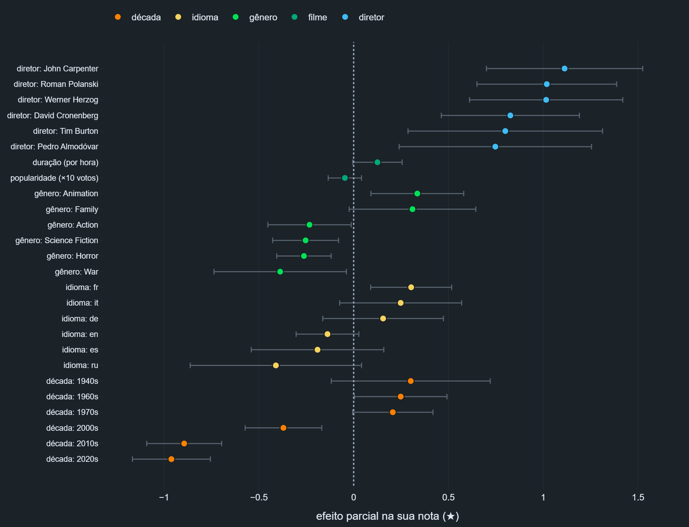 | 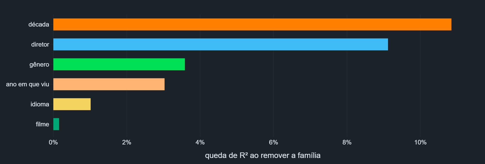 |
| 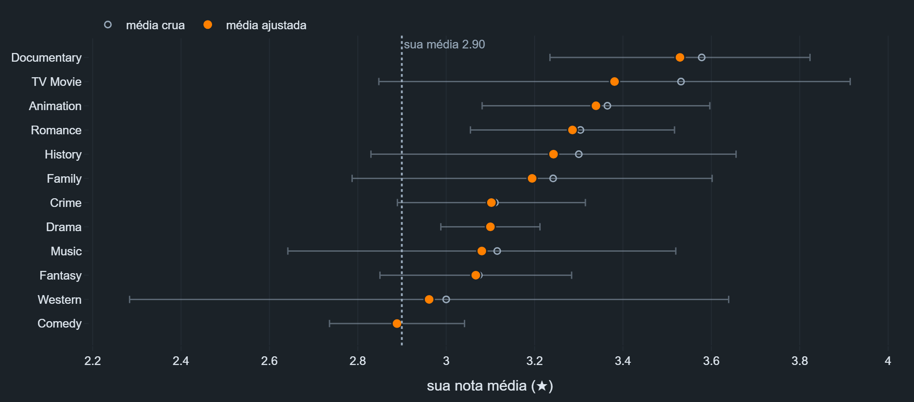 | 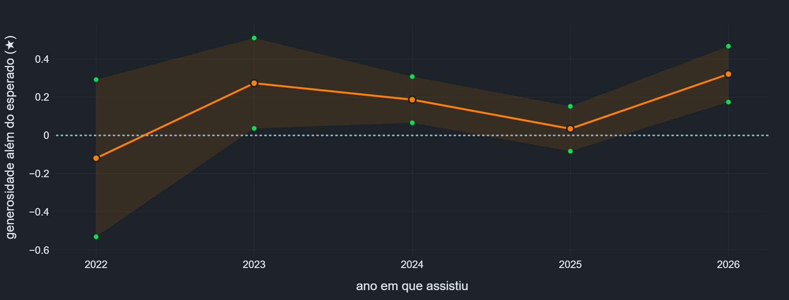 |
| 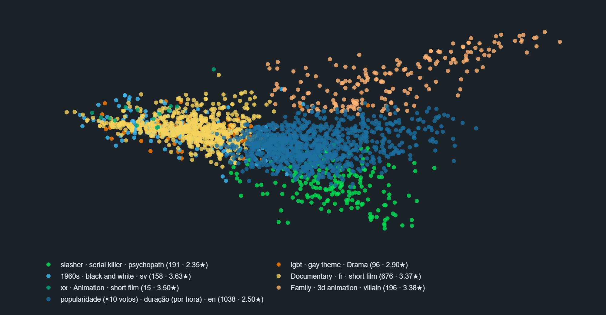 | 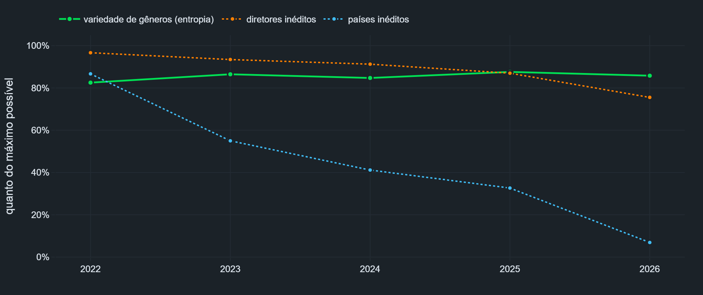 |
|  | 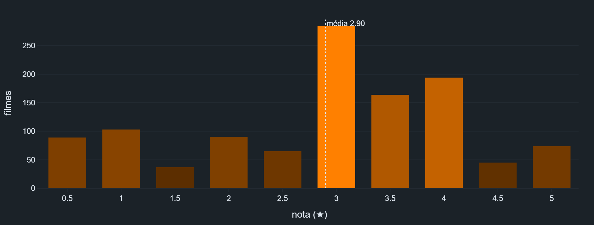 |
|  | 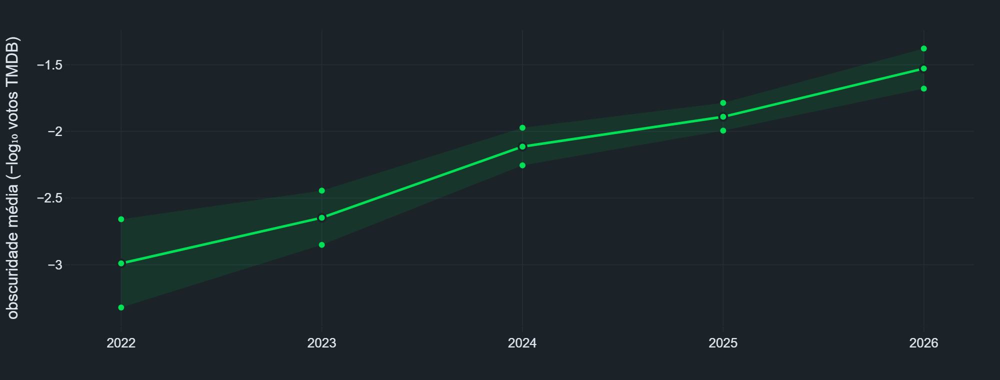 |
| 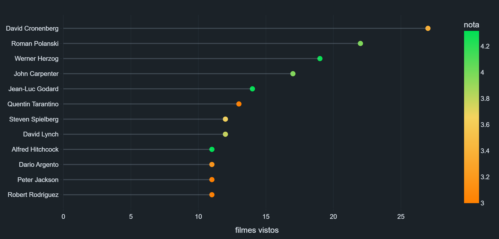 |  |
|  |  |
|  | 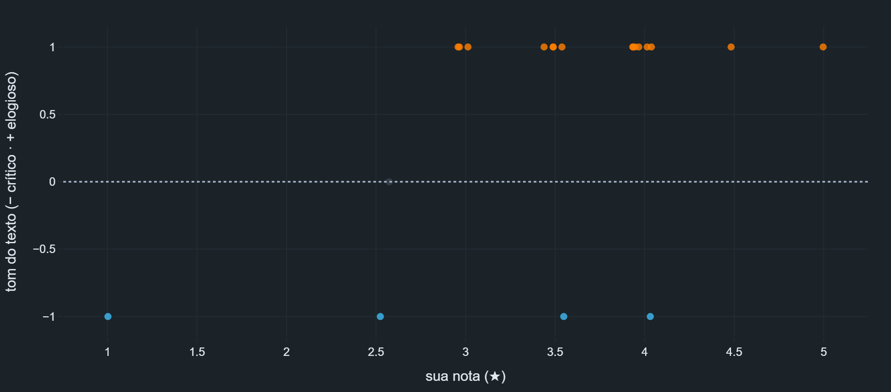 |


As seções com pôsteres e fotos (favoritos mais pessoais, melhor por gênero, joias escondidas, watchlist rankeada, rostos do seu cinema) e as abas por ano são interativas: veja no HTML.

## O que o relatório mostra

Os blocos seguem uma narrativa fixa: panorama, quando você assiste, o que assiste, como avalia, o modelo do gosto, tendências, pessoas e lugares, e o que vem a seguir. Uma barra de atalhos fixa no topo leva a qualquer bloco com um clique; o essencial abre expandido e o secundário fica em "mais análises" (colapsável). Abas por ano com estado persistente na URL e card 9:16 para stories com download em PNG.

| Bloco | O que tem |
|---|---|
| **Visão geral** | Cards de destaque (filmes, horas, nota média, rewatches, watchlist), insights automáticos estilo Wrapped e radar de gêneros |
| **Linha do tempo** | Volume mensal com changepoint testado, calendário estilo GitHub, padrão semanal |
| **O que você assiste** | Décadas, defasagem até assistir, fases (lançamento vs. visualização), gêneros e evolução, sazonalidade com teste qui-quadrado, keywords, duração, raridades, rewatches com teste |
| **Suas notas** | Distribuição, calibração vs. TMDB (Spearman), divergências, nota por gênero com IC, favoritos mais pessoais, joias escondidas |
| **Modelo do gosto** | Efeitos parciais com IC (forest plot) e R² de validação cruzada, anatomia do 5 estrelas (importância validada fora da amostra), benchmark linear × não-linear (gradient boosting), curva de calibração predito × real, generosidade real, watchlist rankeada com faixa de previsão e diversidade, arquétipos (KMeans + PCA) |
| **Exploração e nicho** | Entropia e taxa de inéditos por ano, mainstream vs. cult, retenção de diretores nome a nome, direção feminina |
| **Pessoas e lugares** | Rostos do seu cinema (fotos de diretor e ator mais vistos), scatter de diretores com consistência, rede diretor-ator, mapa-múndi, idiomas |
| **Watchlist e resenhas** | Crescimento da fila, sentimento do texto vs. estrelas, palavras-assinatura |

## Instalação

Requisito: [Python 3.10+](https://www.python.org/downloads/). No Windows, marque **"Add Python to PATH"** durante a instalação.

Baixe este projeto (botão verde **Code** > **Download ZIP**, extraia) e abra um terminal na pasta do projeto.

**Windows (PowerShell):**

```powershell
py -m venv .venv
.venv\Scripts\Activate.ps1
pip install .
```

Se o `Activate.ps1` for bloqueado, rode antes: `Set-ExecutionPolicy -Scope Process Bypass`

**Linux / macOS:**

```bash
python3 -m venv .venv
source .venv/bin/activate
pip install .
```

## Como usar

1. **Exporte seus dados**: em [letterboxd.com](https://letterboxd.com), Settings > Data > **Export your data**. Mova o ZIP para a pasta do projeto (não precisa extrair). Atenção: o export completo pode exigir assinatura Pro.
2. **Crie uma chave gratuita do TMDB**: conta em [themoviedb.org/signup](https://www.themoviedb.org/signup), depois Settings > API > Create. Copie a **API Key**.
3. **Rode** (com o venv ativado):

```bash
letterboxd-explorer letterboxd-seuusuario-2026-01-01.zip --tmdb-key SUA_CHAVE
```

Abra o `relatorio_letterboxd.html` gerado. A primeira execução consulta o TMDB (1 a 3 min por 1000 filmes, incluindo a watchlist); depois tudo fica em `tmdb_cache.json` e é instantâneo.

### Opções

```
letterboxd-explorer EXPORT [opções]

--tmdb-key CHAVE   chave do TMDB (ou variável de ambiente TMDB_API_KEY)
-o saida.html      nome do arquivo de saída
--year 2025        exporta um HTML separado só com um ano (opcional; o
                   relatório padrão já tem abas por ano)
--offline          usa só o cache local, sem API
--retry-misses     rebusca filmes sem correspondência de execuções anteriores
--refresh TÍTULO   força rebuscar um filme casado com o registro errado
--cache arquivo    caminho do cache
--save-figs PASTA  exporta as figuras como PNG (pip install kaleido)
```

### Demo sem chave

```bash
python scripts/make_sample_data.py
letterboxd-explorer sample-export --offline -o demo.html
```

## Arquitetura

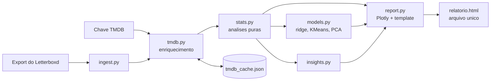

```
src/letterboxd_explorer/
├── cli.py        # linha de comando
├── ingest.py     # leitura do export (ZIP ou pasta) + validação de schema
├── tmdb.py       # cliente TMDB: cache versionado, retry, rate limit, v3/v4
├── stats.py      # análises puras sobre DataFrames (testáveis, sem I/O)
├── models.py     # modelagem: ridge analítico + scikit-learn (sem I/O)
├── insights.py   # frases-insight automáticas
└── report.py     # figuras Plotly e template HTML
```

## Metodologia

Três princípios guiam as análises: **mostrar incerteza** (média sem intervalo de confiança em amostra pequena é ruído travestido de insight), **separar gosto de composição** ("você gosta mais de Drama" pode ser só "você viu mais Drama bom") e **curadoria** (o essencial expandido, o secundário sob demanda).

### O modelo da nota

A peça central é uma regressão ridge com a sua nota como resposta e, como preditores, dummies de gênero, década, diretores recorrentes, idioma e ano em que você assistiu, mais duração e popularidade (log de votos) como variáveis contínuas. Três propriedades importam:

1. Os coeficientes são **efeitos parciais**: o "bônus de Drama" é estimado controlando por década, diretor e tudo o mais, o que também corrige a contagem múltipla de filmes com vários gêneros.
2. A penalização $\alpha$ **encolhe amostras pequenas**, cumprindo o papel de um prior bayesiano (um diretor com 3 filmes não ganha efeito gigante por sorte), e é **escolhida por validação cruzada**, não fixada arbitrariamente.
3. O mesmo modelo é reutilizado: os coeficientes viram o forest plot, a queda de $R^2$ **fora da amostra** ao remover cada família de features vira a "anatomia do 5 estrelas" (medir no treino inflaria famílias com muitos rótulos, como diretor e gênero), e a predição sobre a watchlist vira o ranking do que assistir.

**Números honestos, fora da amostra.** Além do $R^2$ de treino, o relatório mostra o **$R^2$ e o erro médio (MAE) de validação cruzada** (k-fold); o gap entre os dois expõe overfitting. Uma **curva de calibração** compara a nota prevista (out-of-fold) com a nota real, e um **benchmark não-linear** (gradient boosting) mede quanto do seu gosto vive em interações que o modelo aditivo não capta.

Os intervalos dos coeficientes são de **variância do estimador encolhido**, não corrigidos pelo viés do próprio ridge — o relatório os rotula assim, sem fingir que são ICs frequentistas exatos:

$$\widehat{\mathrm{Var}}(\hat\beta) = \hat\sigma^2 \, A^{-1} X^\top X \, A^{-1}, \qquad A = X^\top X + \alpha I.$$

O ridge é resolvido em forma fechada (numpy) porque o scikit-learn não expõe a covariância dos coeficientes; clustering e projeção 2D usam scikit-learn (KMeans com k-means++ e PCA).

### Generosidade sem viés de seleção

A curva ingênua de "nota média por ano" sobe tanto se você ficou generoso quanto se aprendeu a escolher melhor. O relatório usa o **resíduo do modelo** (nota observada menos nota prevista pelas características do filme, sem os dummies de ano): o que sobra é generosidade de fato, ano a ano, com IC.

### Incerteza e testes em tudo

Médias por grupo recebem **encolhimento bayesiano**

$$\tilde\mu_g = \frac{n_g \bar y_g + m \bar y}{n_g + m}$$

e IC de 95%; onde as barras se sobrepõem, o texto avisa que a diferença não é conclusiva. A sazonalidade gênero por mês é um **teste qui-quadrado de independência** com heatmap de observado/esperado. A mudança de ritmo no volume mensal é um **changepoint por segmentação binária** validado com teste t de Welch; rewatch vs. primeira sessão idem. Na comparação com o TMDB, **Spearman sobre notas padronizadas** separa "minha régua é mais dura" (offset médio) de "meu ranking discorda" (correlação), já que escalas 0.5 a 5 e 0 a 10 não são comparáveis por subtração direta.

### Watchlist, clusters e texto

A watchlist é enriquecida no TMDB e pontuada pelo modelo; a predição nunca usa os dummies de "ano em que viu" (não se prevê o passado). Cada filme sai com uma **faixa de previsão** que propaga a covariância dos coeficientes mais o ruído residual, então filmes com poucas pistas conhecidas (diretor fora do vocabulário) recebem intervalo largo em vez de falsa confiança; um re-rank por **MMR** equilibra nota prevista e variedade, para a lista não repetir o mesmo tipo de filme. Como o modelo aprende só com filmes avaliados — um recorte não-aleatório do que você vê —, o relatório avisa que o ranking tende ao que você já conhece. Os **arquétipos** vêm de KMeans sobre gênero, década, idioma e keywords padronizados, projetados em 2D por PCA, com rótulos extraídos das features que mais distinguem cada cluster. Nas resenhas, o sentimento é **léxico** (listas pt/en compactas, sinalizado como heurístico) e as palavras-assinatura ponderam frequência por espalhamento, $\mathrm{tf} \cdot \log(1+\mathrm{df})$. A variedade anual de repertório usa entropia de Shannon normalizada, $H/\log k \in [0, 1]$.

### Cor com significado

Toda a paleta deriva do trio da marca Letterboxd. Verde para volume e contagem; laranja para as suas notas; azul para tempo, fila e neutro; o par azul/laranja como escala divergente (que também é segura para daltônicos), reservada para "acima/abaixo do esperado"; um gradiente laranja > amarelo > verde para nota baixa > alta, no mesmo sentido do slider de estrelas; sequencial única de verdes para intensidade em heatmaps.

## Limitações

* **Curva de sobrevivência da watchlist** ficou de fora por limitação do dado, não da técnica: o export não traz a data de adição dos filmes que *saíram* da lista, o que enviesaria a curva por construção.
* **Campo `gender` do TMDB** é incompleto e binário-centrado; a seção de direção feminina exibe a cobertura do dado e pede leitura como aproximação.
* **Sentimento léxico** é uma heurística com listas compactas de palavras pt/en; ironia, negação e contexto escapam. O gráfico existe para calibração aproximada entre texto e estrela, não como análise de sentimento de produção.
* **Intervalos do ridge** são de variância do estimador encolhido, não corrigidos pelo viés do encolhimento (o relatório os rotula assim); com poucas notas ele omite o modelo. Como contrapeso, $R^2$, erro (MAE) e importância vêm de validação cruzada, e uma curva de calibração mostra se as previsões batem com a realidade.
* **Viés de seleção**: o modelo treina só com filmes que você avaliou (um recorte não-aleatório do que assiste), então a watchlist rankeada tende ao que você já conhece — sinalizado no relatório.
* **Casamento com o TMDB por título e ano** pode errar em raros homônimos; `--refresh` corrige caso a caso.
* **Export do Letterboxd** pode exigir assinatura Pro para contas free.

## Planos futuros

* Filtros globais (período, gênero, "só com nota") reconfigurando todas as views, com seleção cruzada entre gráficos.
* Modelagem de tópicos nas resenhas quando houver volume suficiente de texto.
* Curva de coorte de descoberta de diretores (quando você descobriu vs. quando insistiu).
* Site de demonstração navegável (GitHub Pages) com dados sintéticos.
* Importação alternativa para contas free, respeitando os termos de uso do Letterboxd.

## Contribuições

Sugestões, ideias de análise e reports de bug são muito bem-vindos: abra uma [issue](https://github.com/arthurpmotta02/letterboxd-explorer/issues) descrevendo o caso (se possível com o erro completo e a versão do Python). Pull requests idem; rode `ruff check src tests` e `pytest` antes de enviar.

## Privacidade

Seu histórico é pessoal. O `.gitignore` já impede de subir para o GitHub: `*.zip` (o export), os CSVs, `tmdb_cache.json`, os `*.html` gerados e `.env`. A chave do TMDB vai por argumento ou variável de ambiente, nunca em arquivo versionado. Tudo roda na sua máquina; nenhum dado seu sai dela além das consultas de metadados ao TMDB.

## Desenvolvimento

```bash
pip install -e ".[dev]"
ruff check src tests
pytest
```

CI no GitHub Actions roda lint e testes em Python 3.10 e 3.12. Os testes usam fixtures sintéticas (incluindo dados com sinal plantado para validar que o modelo o recupera) e testes de propriedade: o encolhimento nunca extrapola o intervalo entre a média do grupo e a global, a entropia fica em $[0, \log k]$, a nota prevista fica na escala 0.5 a 5.

## Decisões técnicas

**HTML de arquivo único, sem framework de relatório.** O objetivo é um artefato que qualquer pessoa abre sem instalar nada; o template é gerado em Python com os gráficos Plotly embutidos e só o plotly.js vem de CDN.

**Página única com navegação, não SPA.** Um dashboard multi-tela exigiria servidor ou build de front-end e quebraria o "manda por WhatsApp". A alternativa adotada: barra de atalhos fixa, seções colapsáveis, navegação lateral com scrollspy e abas por ano.

**Enriquecimento paralelo com cache incremental e versionado.** As consultas ao TMDB rodam em 8 threads e o cache é salvo periodicamente: interromper no meio não perde progresso. Campos novos (gender, fotos) são preenchidos por backfill sem rebuscar tudo.

**Análises desacopladas da renderização.** `stats.py` e `models.py` só transformam DataFrames, sem I/O, o que permite testar cada análise isoladamente.

**Validação de schema na entrada.** Se o formato do export mudar, o erro é imediato e legível (essa validação já pegou um caso real: `likes/reviews.csv` do próprio export tem outro formato e sobrescrevia as resenhas).

**Busca com fallback.** O ano do Letterboxd às vezes diverge do TMDB; a busca tenta com o ano e repete sem ele. Filme não encontrado não quebra o relatório.

### Por que TMDB e não a API do Letterboxd?

A [API oficial do Letterboxd](https://letterboxd.com/api-beta/) é liberada mediante aprovação e atualmente não concede acesso para projetos de análise de dados. A própria página recomenda usar o export oficial para os dados pessoais e o [TMDB](https://developer.themoviedb.org/docs/getting-started) para metadados: exatamente a arquitetura deste projeto.

### Tratamento de dados ausentes

**Filmes sem nota** entram em todas as contagens, mas ficam fora das análises de avaliação: sem imputação. **Filmes sem correspondência no TMDB** ficam fora apenas das análises enriquecidas; o cabeçalho informa quantos foram enriquecidos. **Diário escasso**: se você marca filmes como vistos mas raramente usa o diário, as análises temporais usam as datas do `watched.csv`, descartando dias de importação em massa (as seções afetadas avisam no subtítulo). **Datas** em ISO ou DD/MM/AAAA são detectadas automaticamente. **Anos sem atividade** aparecem como linhas vazias no calendário, sem fundir os vizinhos.

## Licença

MIT. Dados de filmes pelo [TMDB](https://www.themoviedb.org); este produto usa a API do TMDB mas não é endossado ou certificado pelo TMDB. Sem afiliação com o Letterboxd.
