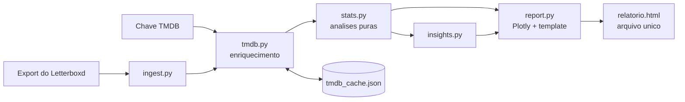

# letterboxd-explorer

[](https://github.com/arthurpmotta02/letterboxd-explorer/actions)


> Análise exploratória completa do seu histórico do Letterboxd em um relatório HTML interativo de arquivo único.

Você entrega o export oficial da sua conta do Letterboxd e recebe um **relatório HTML interativo em arquivo único**: abre em qualquer navegador, dá para mandar por WhatsApp. O export do Letterboxd traz só título, ano, nota e data; gêneros, diretores, elenco, países, duração e keywords são enriquecidos pela [API do TMDB](https://developer.themoviedb.org/) com cache local.

## Sumário

* [Proposta](#proposta)
* [Demonstração](#demonstração)
* [O que o relatório mostra](#o-que-o-relatório-mostra)
* [Instalação](#instalação)
* [Como usar](#como-usar)
* [Arquitetura](#arquitetura)
* [Metodologia](#metodologia)
* [Privacidade](#privacidade)
* [Desenvolvimento](#desenvolvimento)
* [Decisões técnicas](#decisões-técnicas)
* [Licença](#licença)

## Proposta

O Letterboxd mostra *o que* você assistiu; este projeto tenta explicar *como você assiste* — e prever o que vem a seguir. A proposta tem três camadas:

1. **Retrato descritivo**: volume, ritmo, calendário, gêneros, décadas, países, pessoas — o "Wrapped" completo do seu histórico, navegável e bonito, em um único HTML que abre em qualquer lugar.
2. **Inferência honesta**: em vez de comparar médias cruas (que confundem gosto com composição do acervo), um modelo estatístico isola o efeito de cada característica na sua nota, toda média vem com intervalo de confiança, e afirmações como "terror em outubro" passam por teste de hipótese antes de virar frase.
3. **Predição acionável**: o mesmo modelo treinado nas suas notas ordena a sua watchlist pela nota que você provavelmente daria — o relatório termina respondendo "o que eu assisto agora?".

Tudo a partir de dois insumos apenas: o export oficial do Letterboxd (título, ano, nota, data) e a API pública do TMDB (gêneros, elenco, países, duração, votos), com cache local e sem enviar seus dados para lugar nenhum.

## Demonstração

> Imagens geradas com `--save-figs docs/figs` (veja Opções) a partir de um export real.


| | |
|---|---|
|  |  |
|  |  |
|  |  |
|  |  |
|  |  |
|  |  |
|  |  |
|  |  |


As seções com pôsteres (favoritos mais pessoais, melhor por gênero, joias escondidas) e as abas por ano são interativas: veja no HTML.

## O que o relatório mostra

O HTML é organizado em blocos, com abas por ano no topo (Tudo, 2026, 2025...), atalhos laterais para cada bloco, resumo executivo automático e botão de voltar ao topo. Tudo interativo (hover, zoom) e em um único arquivo.

### Visão geral

* **Cards de destaque**: total de filmes, horas de tela, nota média, rewatches, recorde anual e tamanho da watchlist.
* **Resumo executivo**: uma frase automática com seu gênero dominante, diretor mais constante e nota média.
* **Insights automáticos** (estilo Wrapped): seu dia da semana de cinema, maior maratona de dias seguidos, recorde de filmes em um dia, filme-conforto, defasagem média até assistir, nota mais comum, generosidade vs. TMDB, coeficiente cult (% de filmes pouco votados), saudosismo (pré-1980 vs. pós-2000), contraste entre gêneros ("você avalia Drama 0.8 acima de Ação"), contagem de curtas, resenhas e comentários.
* **Perfil por gênero**: radar com o volume relativo dos seus 8 gêneros mais vistos.

### Modelo do gosto (novo na v3)

* **O que de fato eleva a sua nota**: forest plot dos efeitos parciais de um modelo ridge (gênero, década, diretor, duração, popularidade), com IC de 95%. Cada efeito é controlado pelos demais — é o "bônus de Drama" isolado, não a média marginal.
* **Anatomia do seu 5★**: importância de cada família de características (queda de R² ao removê-la).
* **Generosidade real ao longo do tempo**: resíduo do modelo por ano — sua generosidade descontado o efeito de "escolher filmes melhores".
* **Watchlist rankeada pelo seu gosto**: a nota que o modelo prevê que *você* daria a cada filme da watchlist. O "o que assistir a seguir" treinado no seu histórico.
* **Arquétipos do seu gosto**: k-means sobre gênero+década+idioma+keywords, projetado em 2D, com rótulos interpretáveis, tamanho e nota média por grupo.

### Exploração e nicho (novo na v3)

* **Exploração × explotação**: entropia de gêneros por ano + taxa de diretores/países inéditos — seu repertório está se abrindo ou se fechando?
* **Mainstream ↔ cult**: obscuridade média por ano (votos TMDB), com IC — seu gosto está migrando para o nicho?
* **Retenção de diretores**: quantos te fisgaram (3+ filmes) vs. experimentos de uma vez só.
* **Direção feminina ao longo do tempo** (campo `gender` do TMDB, com cobertura sinalizada).

### Linha do tempo

* **Volume mensal** com média móvel de 3 meses para suavizar picos de maratona.
* **Calendário de atividade** estilo GitHub (filmes por semana, ano a ano).
* **Acumulado de visualizações** e **padrão semanal × mensal** (heatmap).

### Suas notas

* **Distribuição das notas** com linha de média.
* **Evolução da nota média** por ano (você está ficando mais generoso?).
* **Sua nota × nota TMDB**: scatter com histogramas marginais e cor pela divergência, com calibração honesta — Spearman separa "régua diferente" de "gosto diferente".
* **Maiores divergências**: barras divergentes azul↔laranja, seguras para daltônicos (o que você defende e o que não perdoa).
* **Nota por gênero com incerteza**: encolhimento bayesiano + IC de 95% em todas as agregações por grupo.
* **Favoritos mais pessoais**: grade de pôsteres dos seus 4.5/5 estrelas mais distantes da nota TMDB (mínimo de 30 votos, para excluir médias sem lastro).
* **Melhor avaliado por gênero**: pôster campeão de cada gênero, com selo.
* **Joias escondidas**: nota alta sua em filmes que pouca gente viu.
* **Popularidade × avaliação**: scatter em escala log com linha de tendência por faixa.

### O que você assiste

* **Décadas de lançamento** (contagem) e **avaliação por década** (bolhas proporcionais).
* **Defasagem lançamento → visualização** com curva de densidade.
* **Lançamento × visualização**: scatter que revela suas fases ("2023 foi meu ano de mergulhar nos anos 70"), colorido pela nota.
* **Gêneros**: contagem, **boxplot de notas por gênero**, **evolução ano a ano** (área empilhada) e **sazonalidade testada** — heatmap de observado/esperado com teste χ² ("outubro tem 2.3× mais terror, p < 0.01"), não só impressão visual.
* **Keywords (microgêneros)** do TMDB: slow burn, neo-noir, coming of age...
* **Duração**: distribuição com KDE e avaliação por faixa, incluindo curtas (≤40 min).
* **Orçamento de produção**, **raridades do acervo** (pôsteres dos menos votados, com contagem dos zero-votos) e **rewatches mais frequentes**.

### Watchlist e resenhas

* **Crescimento da watchlist** e **filmes há mais tempo esperando**.
* **O que você escreve × a nota que você dá**: sentimento léxico (heurístico pt/en) de cada resenha contra a estrela — você elogia com estrelas e reclama com palavras?
* **Suas palavras-assinatura**: termos frequentes E espalhados por muitas resenhas (uma resenha longa não domina o ranking).

### Pessoas e lugares

* **Diretores: volume × avaliação × consistência**: scatter com barras de desvio-padrão (consistente vs. ama-ou-odeia) e cor pela média bayesiana, que desconta amostras pequenas.
* **Atores e atrizes mais frequentes**.
* **Rede de colaborações diretor–ator**: diagrama bipartido das parcerias com 2+ filmes.
* **Mapa-múndi dos países de produção** em escala logarítmica, com os 249 códigos ISO 3166 mapeados (nenhum país é descartado silenciosamente).
* **Idiomas originais** com nomes legíveis.

## Instalação

Requisito: [Python 3.10+](https://www.python.org/downloads/). No Windows, marque **"Add Python to PATH"** durante a instalação.

Baixe este projeto (botão verde **Code** > **Download ZIP**, extraia) e abra um terminal na pasta do projeto.

**Windows (PowerShell):**

```powershell
py -m venv .venv
.venv\Scripts\Activate.ps1
pip install .
```

Se o `Activate.ps1` for bloqueado, rode antes:

```powershell
Set-ExecutionPolicy -Scope Process Bypass
```

**Linux / macOS:**

```bash
python3 -m venv .venv
source .venv/bin/activate
pip install .
```

## Como usar

1. **Exporte seus dados**: em [letterboxd.com](https://letterboxd.com), vá em Settings > Data > **Export your data**. Mova o ZIP baixado para a pasta do projeto (não precisa extrair). *Atenção: o export completo pode exigir assinatura Pro; contas free têm acesso limitado ao recurso — verifique na sua conta.*
2. **Crie uma chave gratuita do TMDB**: conta em [themoviedb.org/signup](https://www.themoviedb.org/signup), depois Settings > API > Create. Copie a **API Key**.
3. **Rode** (com o venv ativado):

```bash
letterboxd-explorer letterboxd-seuusuario-2026-01-01.zip --tmdb-key SUA_CHAVE
```

Abra o `relatorio_letterboxd.html` gerado. A primeira execução consulta o TMDB (1 a 3 min por 1000 filmes); depois tudo fica em `tmdb_cache.json` e é instantâneo.

### Opções

```
letterboxd-explorer EXPORT [opções]

--tmdb-key CHAVE   chave do TMDB (ou variável de ambiente TMDB_API_KEY)
-o saida.html      nome do arquivo de saída
--year 2025        exporta um HTML separado só com um ano (opcional; o
                   relatório padrão já tem abas por ano)
--offline          usa só o cache local, sem API
--retry-misses     rebusca filmes sem correspondência de execuções anteriores
--refresh TÍTULO   força rebuscar um filme casado com o registro errado
--cache arquivo    caminho do cache
--save-figs PASTA  exporta as figuras principais como PNG (pip install kaleido)
```

`--save-figs docs/figs` gera 16 PNGs prontos para ilustrar um README ou post, incluindo calendário, radar, scatters, boxplot, rede de colaborações e o mapa.

### Demo sem chave

```bash
python scripts/make_sample_data.py
letterboxd-explorer sample-export --offline -o demo.html
```

## Arquitetura



```
src/letterboxd_explorer/
├── cli.py        # linha de comando
├── ingest.py     # leitura do export (ZIP ou pasta) + validação de schema
├── tmdb.py       # cliente TMDB: cache versionado, retry, rate limit, v3/v4
├── stats.py      # análises puras sobre DataFrames (testáveis, sem I/O)
├── models.py     # modelagem: ridge, k-means, PCA (numpy puro, sem I/O)
├── insights.py   # frases-insight automáticas
└── report.py     # figuras Plotly e template HTML
```

## Metodologia

Três princípios guiam todas as análises: **mostrar incerteza** (média sem intervalo de confiança em amostra pequena é ruído travestido de insight), **separar gosto de composição** ("você gosta mais de Drama" pode ser só "você viu mais Drama bom") e **curadoria** (o essencial abre expandido; o secundário colapsa em "mais análises").

### O modelo da nota (ridge)

A peça central da v3 é uma regressão ridge com a sua nota como resposta e, como preditores, dummies de gênero, década de lançamento, diretores recorrentes, idioma e ano em que você assistiu, mais duração e popularidade (log de votos TMDB) como variáveis contínuas. Três propriedades importam aqui. Primeiro, os coeficientes são **efeitos parciais**: o "bônus de Drama" é estimado controlando por década, diretor e tudo o mais — o que também resolve o problema de um filme com N gêneros contar N vezes nas médias marginais. Segundo, a penalização do ridge **encolhe amostras pequenas** na direção de zero, cumprindo o papel de um prior bayesiano: um diretor com 3 filmes não ganha um efeito gigante por sorte. Terceiro, o mesmo modelo é reaproveitado três vezes: os coeficientes viram o forest plot, a queda de R² ao remover cada família de features vira a "anatomia do seu 5★", e a predição sobre a watchlist vira o ranking "o que assistir a seguir". Os intervalos exibidos são ICs de 95% aproximados (Var(β) = σ²·A⁻¹XᵀX·A⁻¹, A = XᵀX + αI).

### Generosidade sem viés de seleção

A curva ingênua de "nota média por ano" sobe tanto se você ficou generoso quanto se aprendeu a escolher filmes melhores. A versão da v3 usa o **resíduo do modelo** (nota observada menos nota prevista pelas características do filme, sem os dummies de ano): o que sobra é a sua generosidade de fato, ano a ano, com IC.

### Incerteza e testes em tudo

Médias por grupo (gêneros, décadas) recebem **encolhimento bayesiano** — score = (n·média + m·média_global)/(n + m) — e IC de 95%; onde as barras se sobrepõem, o relatório diz que a diferença não é conclusiva. A sazonalidade gênero × mês é um **χ² de independência** com heatmap de observado/esperado ("2.3× o baseline"), não uma leitura visual. A mudança de ritmo no volume mensal é um **changepoint por segmentação binária** validado com teste t de Welch. Rewatch × primeira sessão idem. Na comparação com o TMDB, **Spearman sobre notas padronizadas** separa "minha régua é mais dura" (offset) de "meu ranking discorda" (correlação) — escalas 0.5–5 e 0–10 não são comparáveis por subtração direta.

### Watchlist, clusters e texto

A watchlist é enriquecida no TMDB e pontuada pelo modelo — a predição nunca usa os dummies de "ano em que viu" (não se prevê o passado). Os **arquétipos de gosto** vêm de k-means (init k-means++) sobre gênero+década+idioma+keywords padronizados, projetados em 2D por PCA, com rótulos automáticos extraídos das features que mais distinguem cada cluster. Nas resenhas, o **sentimento é léxico** (listas pt/en compactas, sinalizado como heurístico) e as **palavras-assinatura** ponderam frequência × espalhamento (tf·log(1+df)), para que uma resenha longa não domine o ranking.

### O que o dado não permite

O honesto também é dizer o que ficou de fora: curva de sobrevivência da watchlist (o export não traz data de adição dos filmes que *saíram* da lista — viés de censura por construção), e o campo `gender` do TMDB é incompleto e binário-centrado (a seção de direção feminina exibe a cobertura do dado e pede leitura como aproximação).

## Privacidade

Seu histórico é pessoal. O `.gitignore` já impede de subir para o GitHub: `*.zip` (o export), os CSVs do export, `tmdb_cache.json`, os `*.html` gerados e `.env`. A chave do TMDB vai por argumento ou variável de ambiente, nunca em arquivo versionado. Tudo roda na sua máquina; nenhum dado seu sai dela além das consultas de metadados ao TMDB.

## Desenvolvimento

```bash
pip install -e ".[dev]"
ruff check src tests
pytest
```

CI no GitHub Actions roda lint e testes em Python 3.10 e 3.12. Os testes usam fixtures sintéticas: não dependem de dados reais nem de chave de API.

## Decisões técnicas

**HTML de arquivo único, sem framework de relatório.** O objetivo é um artefato que qualquer pessoa abre sem instalar nada; o template é gerado em Python com os gráficos Plotly embutidos e só o plotly.js vem de CDN, mantendo o arquivo leve.

**Enriquecimento paralelo com cache incremental.** O gargalo é a rede, não o processamento: as consultas ao TMDB rodam em 8 threads simultâneas e o cache é salvo periodicamente, então interromper no meio (Ctrl+C) não perde progresso e a próxima execução continua de onde parou.

**Análises desacopladas da renderização.** `stats.py` só transforma DataFrames, o que permite testar cada análise isoladamente e trocar o front-end sem reescrever a lógica.

**Busca com fallback.** O ano do Letterboxd às vezes diverge do TMDB (festival × lançamento comercial); a busca tenta com o ano e repete sem ele. Filme não encontrado não quebra o relatório.

**Modelos em numpy puro.** O modelo da nota, a watchlist prevista e os clusters usam ridge regression e k-means implementados à mão (~100 linhas), evitando a dependência pesada de scikit-learn. O encolhimento do ridge cumpre o papel de prior bayesiano nas amostras pequenas de diretor/gênero.

**Incerteza em tudo.** Toda média por grupo (gênero, década, diretor) aparece com encolhimento bayesiano e IC de 95%; sazonalidade tem teste χ²; a mudança de ritmo tem p-valor. Ponto sem incerteza em amostra pequena é ruído travestido de insight.

**Sistema de cor com significado.** Verde de marca = volume/contagem; laranja = suas notas; uma única escala divergente azul↔laranja (segura para daltônicos) reservada para "acima/abaixo do esperado"; sequencial única para intensidade; categórica inspirada em Okabe–Ito para gêneros/clusters.

## Por que TMDB e não a API do Letterboxd?

A [API oficial do Letterboxd](https://letterboxd.com/api-beta/) é liberada apenas mediante aprovação e, atualmente, **não concede acesso para projetos de análise e visualização de dados**. A própria página recomenda usar o export oficial da conta para os dados pessoais e o [TMDB](https://developer.themoviedb.org/docs/getting-started) para metadados de filmes: exatamente a arquitetura deste projeto. Se essa política mudar, o plano é migrar o enriquecimento para a API do Letterboxd.

## Análises consideradas e descartadas

**Curva de sobrevivência (Kaplan-Meier) da watchlist.** A ideia seria modelar "quanto tempo um filme sobrevive na watchlist até ser assistido". Descartada por limitação do dado, não da técnica: o `watchlist.csv` só traz a data de adição dos filmes **ainda não assistidos** (censurados); para os que saíram da lista, a data de adição se perde no export. Sem o tempo de entrada do grupo que sofreu o evento, a curva seria enviesada por construção.

## Tratamento de dados ausentes

**Filmes sem nota.** O Letterboxd só permite notas de 0.5★ a 5★ (não existe "nota zero"). Filmes assistidos sem nota entram em todas as contagens (volume, horas, gêneros, países, décadas...), mas são excluídos de qualquer análise de avaliação: sem imputação, o que evita distorcer médias e distribuições.

**Filmes sem correspondência no TMDB.** Ficam de fora apenas das análises enriquecidas (gêneros, diretores, mapa...); o relatório informa no cabeçalho quantos foram enriquecidos. A busca é configurada para cobertura máxima do histórico, sem filtrar nenhuma categoria de título. Se você rodou uma versão antiga, use `--retry-misses` uma vez para rebuscar filmes que ficaram sem correspondência.

**Filmes com zero votos no TMDB.** Aparecem contabilizados no subtítulo de "Filmes menos conhecidos", mas fora das barras (uma barra de comprimento zero não comunica nada).

**Diário escasso.** Se você marca filmes como vistos mas raramente registra no diário, as análises temporais e as abas por ano usam as datas do `watched.csv` (dia em que o filme foi marcado), descartando dias de importação em massa; as seções afetadas indicam isso no subtítulo.

**Datas.** O parser aceita tanto o formato ISO do export oficial (AAAA-MM-DD) quanto DD/MM/AAAA (arquivos que passaram pelo Excel), detectando automaticamente.

## Licença

MIT. Dados de filmes pelo [TMDB](https://www.themoviedb.org); este produto usa a API do TMDB mas não é endossado ou certificado pelo TMDB. Sem afiliação com o Letterboxd.
