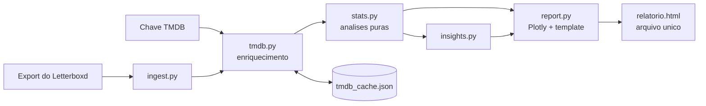

# letterboxd-explorer

Você entrega o export oficial da sua conta do Letterboxd e recebe um **relatório HTML interativo em arquivo único**: abre em qualquer navegador, dá para mandar por WhatsApp. O export do Letterboxd traz só título, ano, nota e data; gêneros, diretores, elenco, países, duração e keywords são enriquecidos pela [API do TMDB](https://developer.themoviedb.org/) com cache local.

## O que o relatório mostra

Mais de 25 visualizações: perfil de gosto (radar), calendário de atividade estilo GitHub, ritmo mensal e curva acumulada, distribuição e evolução das suas notas, hall da fama, você × crítica (com suas maiores "heresias"), décadas, teste de nostalgia, gêneros e microgêneros, sazonalidade dos gêneros (terror em outubro?), suas fases ano a ano, diretores e atores, mapa-múndi dos países de produção, idiomas, duração, filmes-conforto, obscurômetro, indie × blockbuster, e insights automáticos estilo Wrapped (seu dia de cinema, maior maratona, índice hipster, viés de nostalgia...). O relatório tem **abas por ano**: clique em Tudo, 2026, 2025... e veja tudo recalculado só para aquele ano.

## Instalação

Requisito: [Python 3.10+](https://www.python.org/downloads/). No Windows, marque **"Add Python to PATH"** durante a instalação.

Baixe este projeto (botão verde **Code** > **Download ZIP**, extraia) e abra um terminal na pasta do projeto.

**Windows (PowerShell):**

```powershell
py -m venv .venv
.venv\Scripts\Activate.ps1
pip install .
```

Se o `Activate.ps1` for bloqueado, rode antes:

```powershell
Set-ExecutionPolicy -Scope Process Bypass
```

**Linux / macOS:**

```bash
python3 -m venv .venv
source .venv/bin/activate
pip install .
```

## Como usar

1. **Exporte seus dados**: em [letterboxd.com](https://letterboxd.com), vá em Settings > Data > **Export your data**. Mova o ZIP baixado para a pasta do projeto (não precisa extrair).
2. **Crie uma chave gratuita do TMDB**: conta em [themoviedb.org/signup](https://www.themoviedb.org/signup), depois Settings > API > Create. Copie a **API Key**.
3. **Rode** (com o venv ativado):

```bash
letterboxd-explorer letterboxd-seuusuario-2026-01-01.zip --tmdb-key SUA_CHAVE
```

Abra o `relatorio_letterboxd.html` gerado. A primeira execução consulta o TMDB (1 a 3 min por 1000 filmes); depois tudo fica em `tmdb_cache.json` e é instantâneo.

### Opções

```
letterboxd-explorer EXPORT [opções]

--tmdb-key CHAVE   chave do TMDB (ou variável de ambiente TMDB_API_KEY)
-o saida.html      nome do arquivo de saída
--year 2025        exporta um HTML separado só com um ano (opcional; o
                   relatório padrão já tem abas por ano)
--offline          usa só o cache local, sem API
--cache arquivo    caminho do cache
```

### Demo sem chave

```bash
python scripts/make_sample_data.py
letterboxd-explorer sample-export --offline -o demo.html
```

## Arquitetura



```
src/letterboxd_explorer/
├── cli.py        # linha de comando
├── ingest.py     # leitura do export (ZIP ou pasta)
├── tmdb.py       # cliente TMDB: cache, retry, rate limit, chave v3 ou token v4
├── stats.py      # análises puras sobre DataFrames (testáveis, sem I/O)
├── insights.py   # frases-insight automáticas
└── report.py     # figuras Plotly e template HTML
```

## Privacidade

Seu histórico é pessoal. O `.gitignore` já impede de subir para o GitHub: `*.zip` (o export), os CSVs do export, `tmdb_cache.json`, os `*.html` gerados e `.env`. A chave do TMDB vai por argumento ou variável de ambiente, nunca em arquivo versionado. Tudo roda na sua máquina; nenhum dado seu sai dela além das consultas de metadados ao TMDB.

## Desenvolvimento

```bash
pip install -e ".[dev]"
ruff check src tests
pytest
```

CI no GitHub Actions roda lint e testes em Python 3.10 e 3.12. Os testes usam fixtures sintéticas: não dependem de dados reais nem de chave de API.

## Decisões técnicas

**HTML de arquivo único, sem framework de relatório.** O objetivo é um artefato que qualquer pessoa abre sem instalar nada; o template é gerado em Python com os gráficos Plotly embutidos e só o plotly.js vem de CDN, mantendo o arquivo leve.

**Enriquecimento paralelo com cache incremental.** O gargalo é a rede, não o processamento: as consultas ao TMDB rodam em 8 threads simultâneas e o cache é salvo periodicamente, então interromper no meio (Ctrl+C) não perde progresso e a próxima execução continua de onde parou.

**Análises desacopladas da renderização.** `stats.py` só transforma DataFrames, o que permite testar cada análise isoladamente e trocar o front-end sem reescrever a lógica.

**Busca com fallback.** O ano do Letterboxd às vezes diverge do TMDB (festival × lançamento comercial); a busca tenta com o ano e repete sem ele. Filme não encontrado não quebra o relatório.

## Licença

MIT. Dados de filmes pelo [TMDB](https://www.themoviedb.org); este produto usa a API do TMDB mas não é endossado ou certificado pelo TMDB. Sem afiliação com o Letterboxd.
